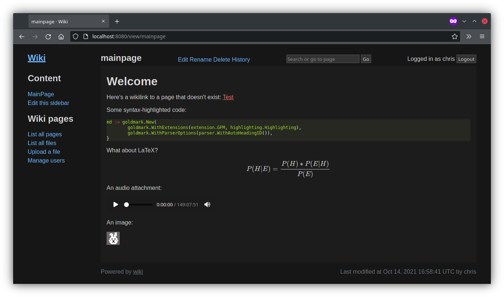

# Wiki

A wiki that runs from a single executable and stores all of its data in Git.



Features:

* Wiki pages are written in Markdown, with support for Github-Flavoured extensions
* Drag and drop file upload support
* Video, audio and image embedding
* LaTeX rendering
* Code block syntax highlighting
* Search across all wikipages
* User accounts and basic access control

## Quick start with Docker

The following docker-compose file will get a basic instance of the Wiki up and
running:

```yaml
version: "3.8"

services:
  wiki:
    image: ghcr.io/mdbot/wiki:latest
    volumes:
      - data:/data
    restart: always
    ports:
      - "8080:8080"
    environment:
      KEY: fc2f036f00786432b3faa9858e8d1ec1b4f587d2d7d266966a63103865a13879
      USERNAME: myuser
      PASSWORD: mypassword

volumes:
  data:
```

Make sure you change the encryption key (see below), and set a username and password
for the initial account.

For production use the Wiki should be hosted behind a TLS-terminating proxy such as
Traefik, Caddy or HAProxy. It does not support TLS directly.

## Configuration

The wiki is configured by passing either command-line flags or environment
variables. The following configuration options are supported:

```
-allow-dangerous-html
    [ALLOW_DANGEROUS_HTML] Whether to allow dangerous HTML such as script tags
-authenticated-reads
    [AUTHENTICATED_READS] Whether to require authentication to read pages/files
-authenticated-writes
    [AUTHENTICATED_WRITES] Whether to require authentication to make changes to pages/files (default true)
-codestyle string
    [CODESTYLE] Style to use for code highlighting. See https://github.com/alecthomas/chroma/tree/master/styles (default "monokai")
-httpport int
    [HTTPPORT] HTTP server port (default 8080)
-key string
    [KEY] Key to use to encrypt config data (32 byes, hex encoded, e.g. from `openssl rand -hex 32`)
-mainpage string
    [MAINPAGE] Title of the main page for the wiki (default "MainPage")
-password string
    [PASSWORD] password for initial account
-username string
    [USERNAME] username for initial account (default "chris")
-workdir string
    [WORKDIR] Working directory (default "./data")
```

### Encryption key

In order to persist runtime settings (user accounts, session keys, CSRF tokens),
you must provide an encryption key either as a CLI argument (`-key`) or
an environment variable (`KEY`). The key should be 32 bytes and
hex-encoded; you can generate such a key using `openssl rand -hex 32`.

### User accounts

You can specify a default username and password using the `username`
and `password` CLI flags, or the `USERNAME` and `PASSWORD` env vars.
These will be used to create a new user if no others exist.

By default, the Wiki is world-readable but only editable by logged-in
users. This can be changed with the `authenticated-reads` and
`authenticated-writes` flags/env vars. 

### Directories

All paths are relative to the working directory, in the container this is /

 - <working directory>/data - Used to store data
 - <working directory>/templates - Used to provide custom templates
 - <working directory>/static - Used to provide custom static content

### Docker

 - working directory is /
 - runs as user 65532:65532
